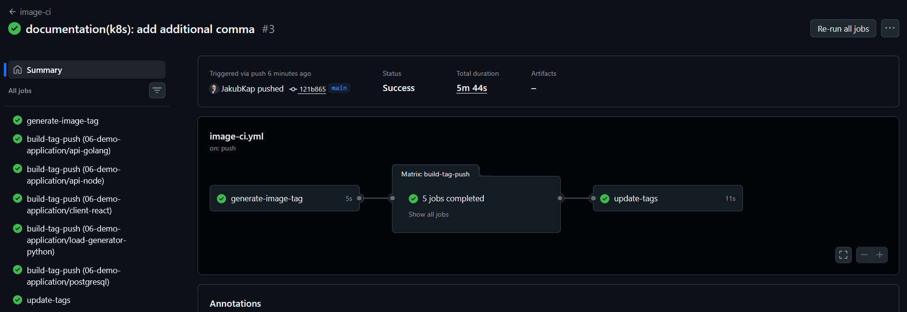
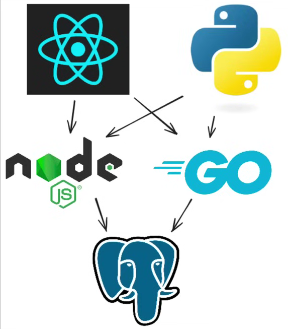
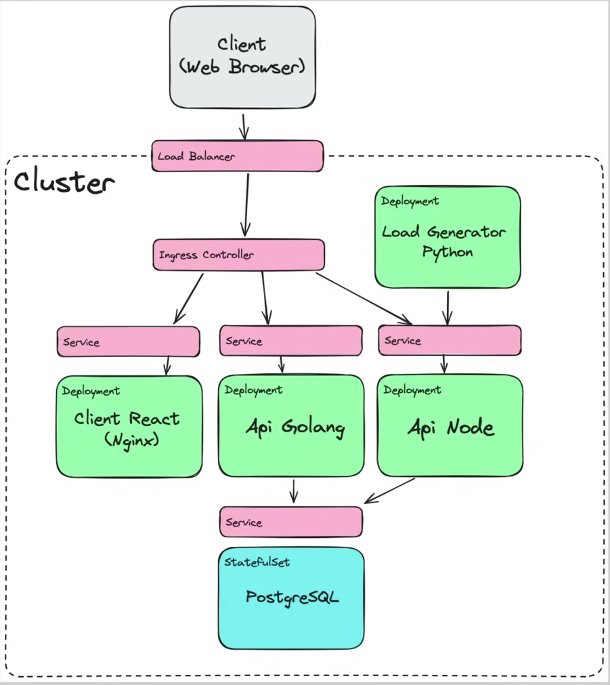
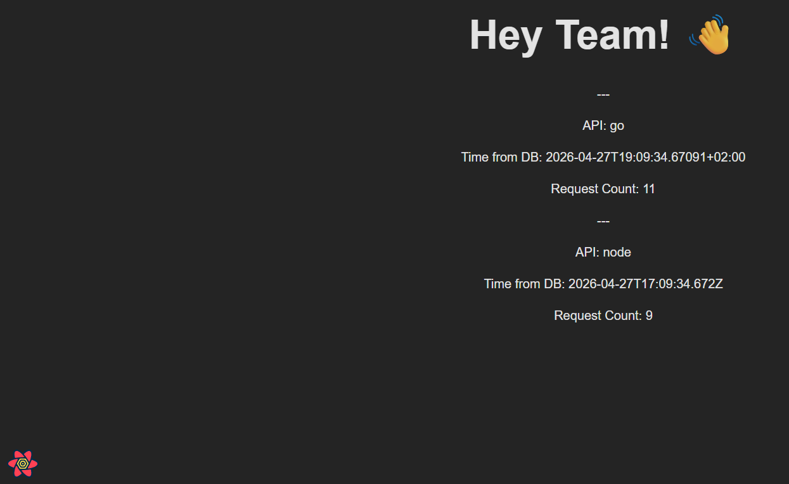
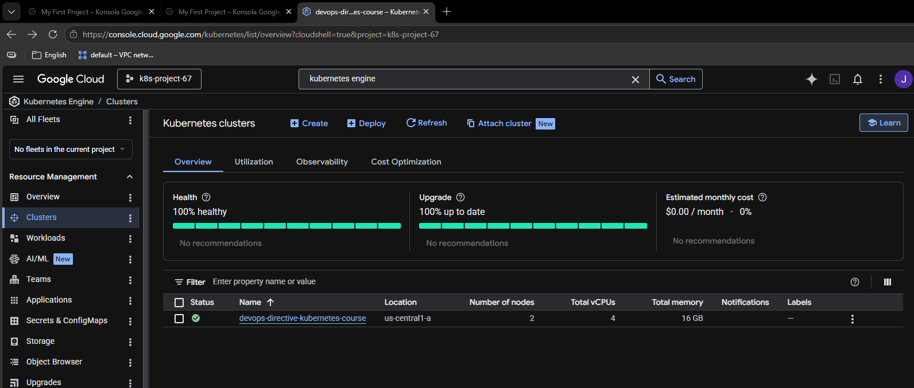
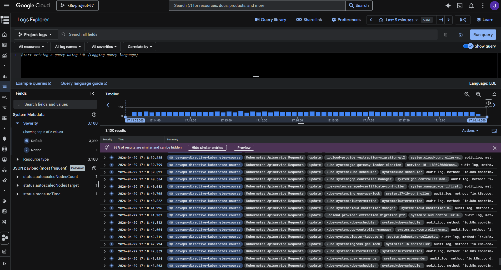
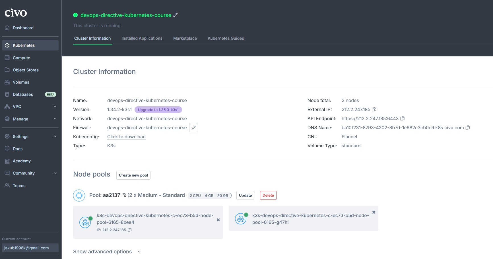

# DevOps Directive — Kubernetes Course

Companion repository for the [Complete Kubernetes Course: From BEGINNER to PRO](https://www.youtube.com/watch?v=2T86xAtR6Fo).

[](https://www.youtube.com/watch?v=2T86xAtR6Fo)

---

## Getting Started

Each directory corresponds to one section of the course. Fork the repo and follow along, modifying the code samples as needed.

Software installation instructions are in [03-installation-and-setup](03-installation-and-setup/README.md).

---

## Technologies

- **[Civo](https://dashboard.civo.com/)** — cloud-hosted Kubernetes clusters
- **GKE (Google Kubernetes Engine)** — Google Cloud cluster experience

---

## Local Development with Devbox

Devbox ensures you use the same dependencies as the course author. Dependencies are defined in `./devbox.json`.

**Windows users** — run from the project root:

```bash
wsl -d Ubuntu
devbox shell
```

> The first run may take a while due to downloading dependencies. Subsequent runs are faster thanks to caching.

```bash
devbox list   # List all installed dependencies
```

---

## CI/CD — GitHub Actions

Workflow file: `.github/workflows/image-ci.yml`



---

## Useful Commands

Common tasks are defined in `Taskfile.yaml`.

| Command | Description                                                     |
|---|-----------------------------------------------------------------|
| `t civo:06-clean-up` | Clean up Civo infrastructure                                    |
| `t gcp:09-clean-up` | Clean up GCP infrastructure                                     |
| `devbox list` | List all Devbox dependencies                                    |
| `kubectx` | Switch context between clusters                                 |
| `k9s` | Text-based UI for K8s management (recommended over Lens)        |
| `kubent` | Detect deprecated APIs in the cluster                           |
| `kubectl explain <RESOURCE>` | Describe fields of a K8s resource type (for instance Namespace) |
| `kubectl get rs` | Show ReplicaSets for a pod                                      |
| `k get pods -o wide` | Show pods with their node assignment                            |
| `k exec -it <POD> -- bash` | Open a shell inside a container                                 |
| `helm create <NAME>` | Create a new Helm chart                                         |

> ⚠️ **Always clean up your clusters when done** — running clusters on Civo and GCP incur costs.

---

## Aliases

```bash
alias k=kubectl
alias t=task
alias tl='task --list-all'
```

---

## Civo API Key

```bash
civo apikey current <KEY_NAME>
# Example key name used in the course: beginner-to-pro
```

---

## Demo Application

A minimal 3-tier web application used throughout the course.

**Components:**
- React front end
- Two API implementations: Node.js (interpreted) and Go (compiled)
- Python load generator
- PostgreSQL database

**Kubernetes resources used:**
- `Deployment` — stateless components
- `StatefulSet` — database (via Helm chart)
- `Service` — stable network endpoints
- `Ingress` — external traffic routing
- `ConfigMap` / `Secret` — configuration management

### Architecture





---

## Screenshots

**GKE Cluster**


**GKE Built-in Logging**


**Civo Cluster**


---

## Troubleshooting

### GCP Billing Not Enabled

```
ERROR: FAILED_PRECONDITION: Billing account for project '...' is not found.
```

**Fix:** Link your billing account to the project:

```bash
gcloud billing projects link <PROJECT_ID> --billing-account=<BILLING_ACCOUNT_ID>
```

Example:
```bash
gcloud billing projects link 1011180695086 --billing-account=012269-BAED37-84FA49
```
